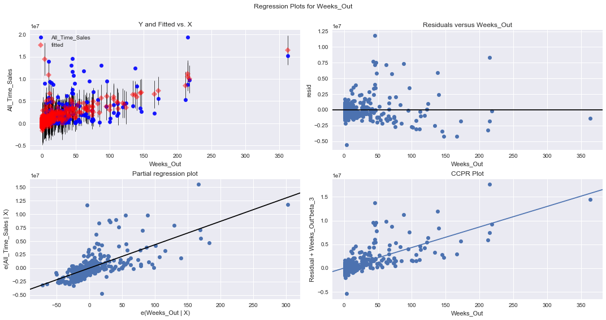

# Using Linear Regression to Predict Video Game Sales

# Project Overview

For this project, I wanted to see if I could predict the total sales of a video game using linear regression. As a gamer, I typically have an intuition of how well a game will sell based on my experience following the industry. I wanted to see if I could quantify this intuition into a linear regression model using Python.

<u><b> Key Variables to Predict Sales </b></u>
 
* How strongly does the genre of the game affect sales?
* Do certain publishers have a strong record of high sales?
* Is there a certain console which will have a stronger impact on sales than others?
* How much better do franchise games sell than new IPs? 

# Data Collection and Wrangling

In order to get the features for my model, I collected my data from VGChartz.com as it had all the information I needed. I collected the top 30 games sold on a weekly basis for 103 weeks. This is because the site did not have any information for the week ending September 16, 2017. Once I scraped the data using beautifulsoup, I put my data into a pandas dataframe in order to clean it up and perform further analysis. The Game Title column had contained the information relating to game genre, publisher, and the console, so I parsed through it through a series of lambda functions to create the columns. If you want to see how I scraped the data from this website, please view my notebook titled: 'Video Game Scraper Notebook'. If you want to see how I cleaned my data in pandas, please view my notebook titled: 'Gaming Data Cleansing'.

My Final DataFrame looked like what you see below:

  

As you can see above, I have a lot of categorical variables which I will be implementing into my OLS model, which I will discuss below. 

# Exploratory Data Analysis
Once I got all my data I performed some exploratory data analysis to take a look at my data. 

  

As you can see above, the most popular consoles between 2017 and 2018 in order were the PS4, Nintendo Switch, Xbox One, and the Nintendo 3DS. 

  

As you can see above, the publishers with the best selling games between 2017 and 2018 included Nintendo, EA, Take-Two, and Activision. This makes sense with the big releases of Super Smash Brothers, Red Dead Redemption 2, Fifa 2019 and Madden 2k19, and Call of Duty which are the main staples of these publishers.

  

As you can see above, the most popular genres included Action, Shooter, and Sports which is in line with the top publishers chart. 

# Initial Ordinary Least Squares Result

  

Because most of my data consisted of categorical variables, there isn't a lot I can do to improve this result besides getting rid of the features that had a high P-value since they did not help my model explain the sales of the games. After I got rid of them, my final OLS and coefficients consisted of the following:

  

  

As you can see from above, consoles had a negative coefficient along with really high P-values when it came to predicting total sales of video games. This makes sense because games sell consoles, not the other way around. For example, the release of Super Smash Brothers Ultimate has the capability of spiking Nintendo Switch sales because people want to play that game. A few other things to highlight include the extraordinarily high coefficients for Take-Two Interactive, Nintendo, Sony Computer Entertainment, EA, and Activision. These publishers are amongst the heavy hitters in the industry and it makes sense for their association with a title to automatically increase the sale prospects of a game.

# Final OLS Analysis and Next Steps

  

  

Based on my Y and fitted vs X graph, it is evident that I need to implement stronger variables into my model to make the relationship more apparent and linear. Right now, it is only slightly sloping upwards indicating that weeks released and sales have a slight correlation. If I were to obtain datapoints on the review scores for the games in my dataset, I believe the correlation line would improve.

Based on my residuals plot, there does appear to be randomness on my graph which indicates that the OLS assumption of homoskedasticity holds.

Finally, based on my QQ Plot, it appears that my data has features of both a negative skew and a positive skew, with the positive skew being stronger. Also, both ends of my plot move away from the normal distribution line indicating fat tails on my distribution plot. This is a strong indicator that additional sources of data would be very helpful in normalizing my data and providing additional insight on what affects the sales of video games. 

To improve this model, I wanted to include the reviews of the games in my data because there should be a strong influence of a high rating and the sales of the game which would help improve my coefficient of determination. However, the metacritic was not scraping friendly and so I was not able to obtain that data.
